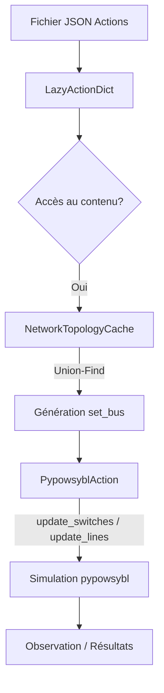

# Gestion des Actions et de la Topologie dans Expert_Op4grid_Assist

Dans le projet **Expert_Op4grid_Assist**, la gestion des actions et de la topologie repose sur une architecture hybride qui combine la puissance de simulation de **pypowsybl** avec une logique de transformation analytique optimisée (inspirée de Grid2Op).

## 1. Dictionnaire d'Actions et Enrichissement

Le dictionnaire d'actions est la source de vérité pour tous les remèdes possibles.

*   **Chargement initial** : Les actions sont chargées depuis un fichier JSON via `load_actions`. Chaque entrée définit soit des changements d'états de commutateurs (`switches`), soit des déconnexions de lignes (actions `disco_`).
*   **Enrichissement Paresseux (`LazyActionDict`)** : Pour optimiser les performances, le dictionnaire est enveloppé dans un `LazyActionDict`. Le champ `content` (qui contient les impacts topologiques réels) n'est calculé qu'au moment de l'accès.
*   **Calcul du Contenu** : Si une action ne contient que des `switches`, le système utilise le `NetworkTopologyCache` pour déduire automatiquement quel élément (ligne, charge, générateur) finit sur quel bus électrique.

## 2. Gestion Analytique de la Topologie (Union-Find)

L'une des innovations majeures pour le backend `pypowsybl` est l'évitement des clonages de réseaux (`clone_variant`), opération coûteuse en ressources.

*   **`NetworkTopologyCache`** : Cette classe extrait la structure "Bus-Breaker" du réseau `pypowsybl` lors de l'initialisation. Elle identifie les noeuds électriques et les interrupteurs qui les relient.
*   **Algorithme Union-Find** : Pour chaque action, le système simule les changements d'état des interrupteurs en Python pur à l'aide d'un algorithme de **Union-Find** (ensembles disjoints).
    *   Il calcule quels noeuds sont connectés entre eux pour former des "bus" électriques.
    *   Il détermine la nouvelle topologie sans toucher au réseau `pypowsybl` réel.

## 3. Transformations et Formats

Le système navigue entre trois formats de représentation :

1.  **Format REPAS / Switch** : Liste de commutateurs et leurs états (ouvert/fermé). C'est le format "bas niveau" de l'action.
2.  **Format `set_bus` (Grid2Op style)** : Dictionnaire mappant chaque terminal d'équipement à un numéro de bus (1, 2, ... ou -1 pour déconnecté).
    *   La transformation **Switch -> `set_bus`** est effectuée par le `NetworkTopologyCache`.
    *   Les bus sont réindexés de manière séquentielle (1, 2, 3...) par poste électrique pour garantir une cohérence visuelle et logique.
3.  **Format `topo_vect`** : Un vecteur numpy concaténant toutes les assignations de bus de la grille, utilisé pour les calculs internes et la compatibilité avec les algorithmes de recommandation.

## 4. Backend pypowsybl et Simulation

Le backend `pypowsybl` fait le pont entre ces représentations et le simulateur physique.

*   **`SimulationEnvironment`** : Enveloppe le réseau et expose une interface similaire à Grid2Op. Elle permet d'utiliser `obs.simulate(action)`.
*   **`ActionSpace`** : Reçoit un dictionnaire d'action (contenant soit des `switches`, soit un `set_bus`) et crée un objet `PypowsyblAction`.
*   **Application Physique** :
    *   Si l'action contient des `switches`, elle appelle `net.update_switches`.
    *   Si elle contient un `set_bus`, elle traduit cela en appels `net.update_lines(connected1=...)`, etc., pour refléter l'état de connexion souhaité.
    *   Une fois la topologie modifiée sur une variante temporaire du réseau, le `load_flow` est exécuté.

## 5. Exemples Concrets de Transformations

### 5.1 Instance d'Action JSON (Format "Switch")
C'est le format stocké en base ou dans les fichiers de configuration. Il décrit l'intention de manoeuvre.

```json
{
  "fb2a0db8-20cf-4ef7-940d-22dc59de7d9a": {
    "description": "Fermeture OC 'VIELM6AT762 DJ_OC' dans le poste 'VIELMP6'",
    "switches": {
      "VIELMP6_VIELM6AT762 DJ_OC": false
    },
    "VoltageLevelId": "VIELMP6"
  }
}
```

### 5.2 Transformation en `set_bus` (Format Grid2Op)
Après passage dans le `NetworkTopologyCache`, l'action est enrichie de son impact sur les équipements. Si la fermeture de l'interrupteur ci-dessus connecte une ligne au bus 1, le `set_bus` ressemblera à ceci :

```json
"content": {
  "set_bus": {
    "lines_or_id": { "VIELM6AT762": 1 },
    "lines_ex_id": {},
    "loads_id": {},
    "generators_id": {}
  },
  "switches": { "VIELMP6_VIELM6AT762 DJ_OC": false }
}
```

### 5.3 Action de Déconnexion (`disco_`)
Pour une action de type `disco_AISERL31MAGNY`, la transformation est triviale et ne nécessite pas de calcul UF :

```json
"content": {
  "set_bus": {
    "lines_or_id": { "AISERL31MAGNY": -1 },
    "lines_ex_id": { "AISERL31MAGNY": -1 },
    "loads_id": {},
    "generators_id": {}
  }
}
```

### 5.4 Ouverture de Couplage (Split de Poste)
C'est l'exemple le plus complexe. L'ouverture d'un seul interrupteur de couplage (`COUPL`) entraîne le recalcul complet de l'assignation des bus pour TOUS les équipements du poste concerné via l'algorithme Union-Find.

**Action JSON :**
```json
"180c19aa-762d-4d6f-a74c-4fd5432aa5d1_CPVANP3": {
  "description": "Ouverture OC 'CPVAN3COUPL DJ_OC' dans le poste 'CPVANP3'",
  "switches": { "CPVANP3_CPVAN3COUPL DJ_OC": true },
  "VoltageLevelId": "CPVANP3"
}
```

**Impact `set_bus` résultant (Analyse Topologique) :**
Le système détecte que le poste est maintenant scindé en deux. Certains équipements restent sur le bus 1, d'autres basculent sur le bus 2.

```json
"content": {
  "set_bus": {
    "lines_or_id": { "CPVANL31RIBAU": 1, "CPVANL61PYMON": 2 },
    "lines_ex_id": { "CHALOL61CPVAN": 1, "COUCHL61CPVAN": 2 },
    "loads_id": { "LOAD_CPVAN": 1 },
    "generators_id": { "GEN_CPVAN": 2 }
  },
  "switches": { "CPVANP3_CPVAN3COUPL DJ_OC": true }
}
```

### 5.5 Topologie renvoyée par l'API Backend
L'API d'Expert Assist renvoie une vue synthétique (`action_topology`) pour le frontend :

```json
"action_topology": {
  "lines_or_bus": { "VIELM6AT762": 1 },
  "lines_ex_bus": {},
  "gens_bus": {},
  "loads_bus": {},
  "substations": {},
  "switches": { "VIELMP6_VIELM6AT762 DJ_OC": false }
}
```

## Résumé du Flux de Données



> [!TIP]
> L'utilisation de l'algorithme Union-Find en Python permet d'accélérer considérablement la phase de découverte d'actions, car elle évite d'interagir avec le moteur C++ de pypowsybl pour chaque simulation de topologie intermédiaire.
