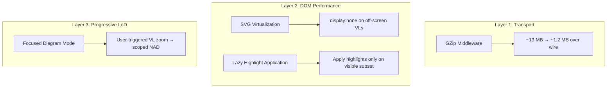
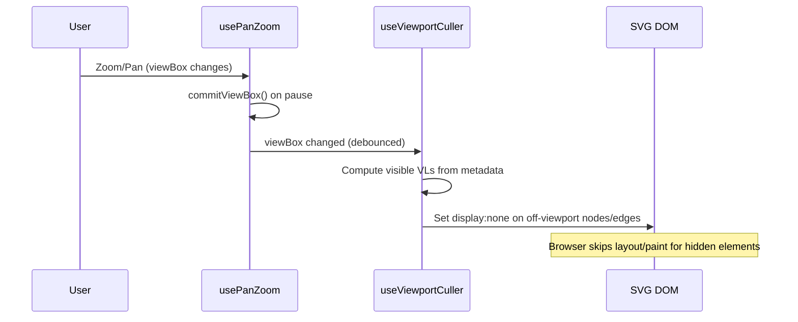
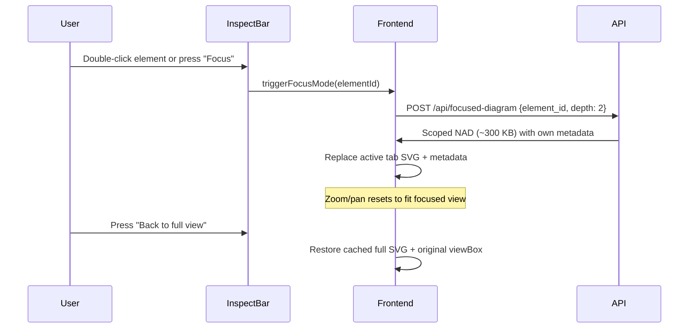

# Phase 3: SVG Rendering Enhancement — Improved Proposal

## Problem Statement

Large SVG payloads (~13 MB for the full French grid NAD) cause UI freezes and degraded responsiveness. The full SVG DOM contains thousands of elements that slow down React reconciliation, pan/zoom interactions, and highlight application.

## Prior Art & Lessons Learned

From [nad_optimization.md](file:///home/marotant/dev/AntiGravity/ExpertAssist/docs/nad_optimization.md):

| Strategy | Result | Why |
|---|---|---|
| **Voltage-bound filtering** | ❌ Discarded | Only ~11% reduction, risk of hiding critical weak components |
| **Viewport-based NAD** | ❌ Reverted | 50× payload reduction but **highlight inconsistency**, zoom/pan lag, multi-state coordination complexity |
| **Tiled Canvas/WebGL** | 💡 Recommended | 98% reduction, preserves highlighting — but massive effort, no pypowsybl canvas renderer exists |

> [!IMPORTANT]
> The original proposal's "Hybrid Spatial LoD with Highlight Preservation" is essentially a refined version of the previously reverted **Strategy 3**. While the highlight-sync idea addresses one failure mode, it doesn't solve the deeper issues (coordinate remapping across macro↔micro views, multi-tab SVG state coordination for N/N-1/Action). Below we propose an approach that avoids those pitfalls entirely.

---

## Revised Strategy: Progressive Client-Side Culling + GZip + Deferred Rendering

Instead of regenerating new SVGs from the backend on zoom (which is what caused the original Strategy 3 failure), we keep the **single full SVG** approach and optimize what happens with it on the client and transport layer.

### Why Not BBox-Based Backend Requests?

The original proposal's `POST /api/diagram-bbox` approach has structural issues specific to this codebase:

1. **Three independent diagram states** — `nDiagram`, `n1Diagram`, `actionDiagram` each have their own SVG. A BBox request would need to regenerate all three simultaneously (or accept visual mismatches between tabs).
2. **Coordinate instability** — pypowsybl `get_network_area_diagram` with a VL subset produces a *completely different layout* than the full-grid diagram. Coordinates don't match between macro and micro views, so seamless "DOM swap" is impossible without visible jumping.
3. **Highlight metadata depends on analysis state** — Overload, contingency, and action-target highlights are computed from network simulation results, not just SVG IDs. Synchronizing them across partial/full views adds complex state that was exactly why Strategy 3 was reverted.
4. **`usePanZoom` is viewBox-based** — The existing hook manipulates the SVG `viewBox` attribute directly via refs (bypassing React). The pan/zoom state is a `ViewBox` object `{x, y, w, h}`. Swapping the SVG element mid-interaction would lose this state and invalidate the cached `DOMMatrix` (CTM).

---

## Proposed Solution: 3-Layer Optimization



---

### Layer 1: GZip Transport Compression (1 day — immediate win)

The backend already imports `GZipMiddleware` but it's **commented out** ([main.py:85](file:///home/marotant/dev/AntiGravity/ExpertAssist/expert_backend/main.py#L85)):

```python
# app.add_middleware(GZipMiddleware, minimum_size=10000)
```

SVG is highly compressible (repetitive XML namespace declarations, path data). Enabling this alone reduces transfer from ~13 MB to ~1–1.5 MB with zero client-side changes.

#### Changes

| File | Change |
|---|---|
| [main.py](file:///home/marotant/dev/AntiGravity/ExpertAssist/expert_backend/main.py#L85) | Uncomment `GZipMiddleware`, set `minimum_size=5000` |

> [!NOTE]
> This is already proven infrastructure — FastAPI's GZipMiddleware handles `Accept-Encoding` negotiation automatically. `axios` decompresses transparently.

---

### Layer 2: Viewport-Aware DOM Culling (3–5 days)

Instead of regenerating SVGs server-side, **hide DOM elements that are outside the viewport** using the metadata index that already exists.

#### Key Insight

The codebase already does this for voltage filtering! See [useDiagrams.ts:595-644](file:///home/marotant/dev/AntiGravity/ExpertAssist/frontend/src/hooks/useDiagrams.ts#L595-L644) — `applyVoltageFilter` iterates over `nodesByEquipmentId` and `edgesByEquipmentId` and sets `el.style.display = 'none'` for elements outside the voltage range. We adapt this exact pattern for spatial culling.

#### How It Works



#### New Hook: `useViewportCuller.ts`

```typescript
export function useViewportCuller(
  container: RefObject<HTMLDivElement | null>,
  metaIndex: MetadataIndex | null,
  viewBox: ViewBox | null,
  enabled: boolean,           // Only cull when zoomed > threshold
  debounceMs = 200,
) {
  useEffect(() => {
    if (!container.current || !metaIndex || !viewBox || !enabled) return;

    const timer = setTimeout(() => {
      const idMap = getIdMap(container.current!);
      const { nodesByEquipmentId, nodesBySvgId, edgesByEquipmentId } = metaIndex;
      const margin = 0.2; // 20% padding around viewport
      const vx = viewBox.x - viewBox.w * margin;
      const vy = viewBox.y - viewBox.h * margin;
      const vw = viewBox.w * (1 + 2 * margin);
      const vh = viewBox.h * (1 + 2 * margin);

      // Cull voltage level nodes
      for (const [, node] of nodesByEquipmentId) {
        const visible = node.x >= vx && node.x <= vx + vw
                     && node.y >= vy && node.y <= vy + vh;
        const el = idMap.get(node.svgId) as HTMLElement | undefined;
        if (el) el.style.display = visible ? '' : 'none';
        // Also hide legend elements
        if (node.legendSvgId) {
          const leg = idMap.get(node.legendSvgId) as HTMLElement | undefined;
          if (leg) leg.style.display = visible ? '' : 'none';
        }
      }

      // Cull edges: visible if either endpoint node is visible
      for (const [, edge] of edgesByEquipmentId) {
        const n1 = nodesBySvgId.get(edge.node1);
        const n2 = nodesBySvgId.get(edge.node2);
        const vis = (n1 && n1.x >= vx && n1.x <= vx+vw && n1.y >= vy && n1.y <= vy+vh)
                 || (n2 && n2.x >= vx && n2.x <= vx+vw && n2.y >= vy && n2.y <= vy+vh);
        const el = idMap.get(edge.svgId) as HTMLElement | undefined;
        if (el) el.style.display = vis ? '' : 'none';
      }
    }, debounceMs);

    return () => clearTimeout(timer);
  }, [container, metaIndex, viewBox, enabled, debounceMs]);
}
```

#### Integration in `useDiagrams.ts`

```typescript
// After existing PanZoom setup (line ~156)
const CULL_ZOOM_THRESHOLD = 1.5; // Only cull when zoomed in enough

// N tab viewport culling
const nCullEnabled = activeTab === 'n' && nPZ.viewBox != null
  && originalViewBox != null
  && (originalViewBox.w / (nPZ.viewBox.w || 1)) > CULL_ZOOM_THRESHOLD;
useViewportCuller(nSvgContainerRef, nMetaIndex, nPZ.viewBox, nCullEnabled);

// Repeat for n1 and action tabs...
```

#### Why This Works

- **No backend changes** — Same SVG, same metadata, same highlights
- **No coordinate mismatch** — Elements stay in place, just hidden
- **Highlights preserved** — Highlight classes remain on elements; they become visible when scrolled into view
- **Consistent pattern** — Identical to existing voltage-range filter logic
- **Reversible** — On zoom out, all elements unhide instantly

#### Performance Impact

For a 10k-element grid at 2× zoom showing ~15% of the viewport:
- **DOM nodes rendered**: ~1,500 instead of ~10,000
- **Paint time**: Reduced ~5–7× (fewer elements to composite)
- **Highlight application**: Only scans visible subset

---

### Layer 3: User-Triggered Focused Diagrams (already exists — enhance UX)

The `/api/focused-diagram` endpoint ([main.py:534-565](file:///home/marotant/dev/AntiGravity/ExpertAssist/expert_backend/main.py#L534-L565)) already supports VL-scoped NAD generation with `voltage_level_ids` + `depth`. This generates a small, clean sub-diagram (~200–400 KB) centered on a specific element.

Currently, `zoomToElement` ([useDiagrams.ts:471-577](file:///home/marotant/dev/AntiGravity/ExpertAssist/frontend/src/hooks/useDiagrams.ts#L471-L577)) only adjusts the viewBox. We enhance it with an **optional "Focus Mode"** that swaps in a focused diagram.

#### UX Flow



#### Key Difference from BBox Approach

- **User-triggered**, not automatic — no coordinate sync needed
- **Clean layout** — pypowsybl generates a proper layout for the subset
- **Full highlights** — `_generate_diagram` + highlight application runs on the focused SVG
- **Already built** — backend endpoint exists; only frontend UX needs polish

#### Changes Required

| File | Change |
|---|---|
| [useDiagrams.ts](file:///home/marotant/dev/AntiGravity/ExpertAssist/frontend/src/hooks/useDiagrams.ts) | Add `focusedDiagram` state, `enterFocusMode` / `exitFocusMode` functions |
| [VisualizationPanel.tsx](file:///home/marotant/dev/AntiGravity/ExpertAssist/frontend/src/components/VisualizationPanel.tsx) | Add "Focus" button in toolbar; render focused SVG when active |
| [api.ts](file:///home/marotant/dev/AntiGravity/ExpertAssist/frontend/src/api.ts) | Add `getFocusedDiagram(elementId, depth)` method (endpoint already exists) |

---

## Comparison: Original Proposal vs. Improved Proposal

| Aspect | Original (BBox LoD) | Improved (Client Culling + Focus) |
|---|---|---|
| **Backend changes** | New endpoint + spatial filter | Uncomment 1 line (GZip) |
| **Frontend complexity** | New hook + DOM swap + highlight sync | New `useViewportCuller` (follows existing pattern) |
| **Highlight consistency** | Requires metadata sync across views | Automatic — elements keep their classes |
| **Coordinate stability** | Different layout per BBox → visual jumps | Same SVG → no jumps |
| **Multi-tab support** | Must regenerate N/N-1/Action per BBox | Works on all tabs independently |
| **Payload reduction** | ~50× (server regen) | ~10× (GZip) + rendering ~5× faster (DOM cull) |
| **Risk** | High — mirrors reverted Strategy 3 | Low — extends proven voltage-filter pattern |
| **Effort** | 4 weeks | 1–1.5 weeks |

---
## The Actual Bottleneck

When you select a contingency on the full grid, here's what happens:

| Step | Time | Blocks UI? |
|------|------|------------|
| Backend generates N-1 diagram | ~5.1s | No (async) |
| `boostSvgForLargeGrid` parses SVG string → modifies DOM → **serializes back to string** | ~500-645ms | **Yes** |
| `innerHTML = boostedSvgString` (browser re-parses the 13MB string into DOM) | ~1.3-1.6s | **Yes** |
| **Total main-thread freeze** | **~1.8-2.2s** | |

The critical insight: **the SVG is parsed into DOM twice**. Once inside `boostSvgForLargeGrid` (to apply scaling), then serialized back to a string, then parsed *again* by `innerHTML`. That double-parse is the freeze.

### Concrete Solution: Eliminate the Double-Parse

Instead of:

1. Parse SVG → DOM *(boost, ~500ms)*
2. Serialize DOM → string *(boost, included)*
3. Parse string → DOM *(innerHTML, ~1.5s)*

We do:

1. Parse SVG → DOM *(boost, ~500ms)*
2. **Move the DOM node directly into the container** *(~1ms)*

This means:

- `processSvg` returns the **DOM element** instead of a string
- `MemoizedSvgContainer` uses `container.replaceChildren(svgElement)` instead of `innerHTML`
- **Expected savings: ~1.3-1.6s (the entire second parse is eliminated)**

---

## Profiling Data (Before Changes)

### API Timings

| Endpoint | Time |
|----------|------|
| `GET /api/config-file-path` | ~11-12ms |
| `GET /api/user-config` | ~12ms |
| `POST /api/config` | **9079ms** |
| `GET /api/voltage-levels` | 28.5ms |
| `GET /api/nominal-voltages` | 181.5ms |
| `GET /api/branches` | 189.6ms |
| `GET /api/network-diagram` (base) | **5381.5ms** |
| `POST /api/n1-diagram` | **5133.6ms** |

### Frontend Processing (Main Thread)

| Step | Metric | Time |
|------|--------|------|
| SVG fetch (base diagram) | `perf:fetch:base` | 5381.8ms |
| viewBox processing | `perf:processSvg:viewBox` | ~0.08-0.11ms |
| SVG boost (6835 VLs, ratio 1315×) | `perf:processSvg:boost` | **389–464ms** |
| Full SVG processing (base) | `perf:process:base` | 464.4ms |
| Metadata index build (base) | `perf:index:base` | 39–53ms |
| Metadata index build (N-1) | `perf:index:n1` | 31–34ms |
| **DOM injection (base diagram)** | `perf:dom-injection:n` | **118ms** |
| **DOM injection (N-1 diagram)** | `perf:dom-injection:n-1` | **369ms** |

### Key Observations

- The **N-1 DOM injection takes 369ms** vs. 118ms for the base diagram — 3× slower, consistent with the double-parse hypothesis on a larger/different SVG payload.
- `buildMetadataIndex` triggers a spurious `Timer does not exist` warning each time, suggesting the `console.time` / `console.timeEnd` calls are mismatched (likely a `StrictMode` double-invoke artifact).
- Backend config loading (`POST /api/config`) is a one-time 9s cost on startup, not on the hot path.
